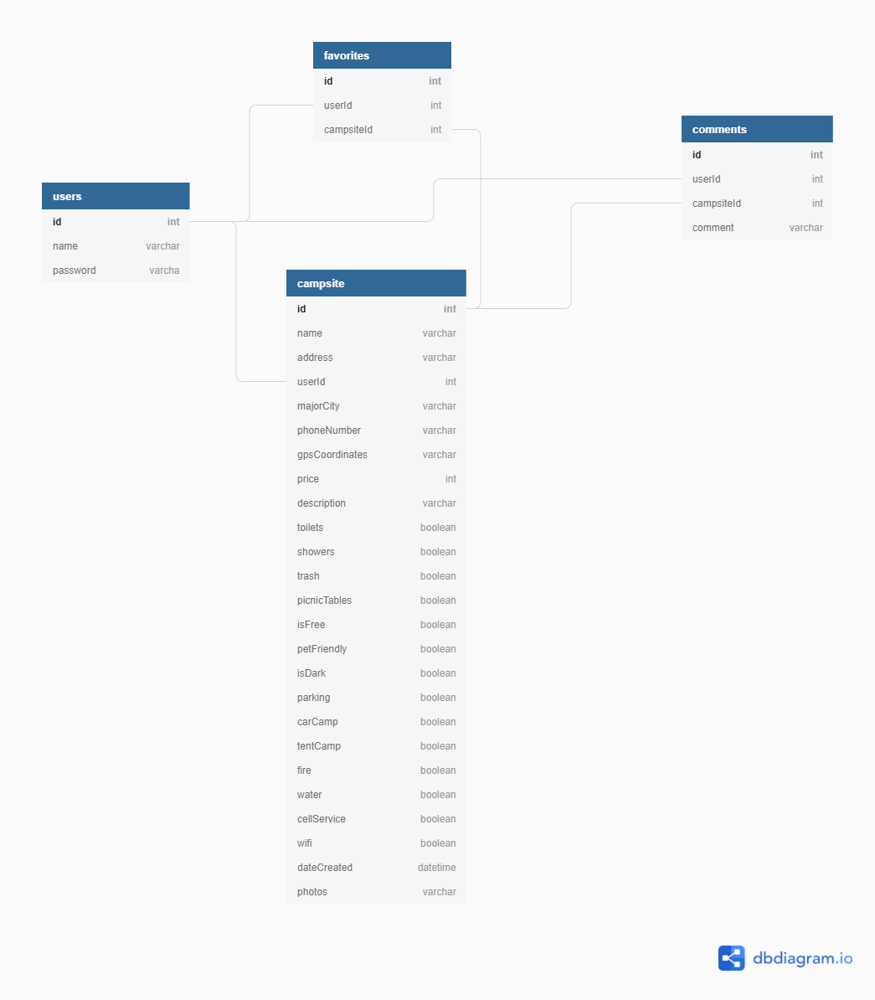

## InTents

<b style="font-size: 24px;"><i>The LAST camping app you ever need!</i></b>

### Overview
InTents is a camping application desinged to be easy to use and minialistic in nature, just like camping. It allows users to interact in real time with campsites and see up-to-date information about the places they plan to visit on thier next adventure. Never before has planing what to bring and how to be prepared been so simple. 

### Features

• Users can explore campsites on the sites and gather valuable information before thier next trip 
• Users can add new sites to the database. 
• Users can edit thier contributions and change the information as needed.

### Technologies Used

       

#### Built by Jake Kunsman

 